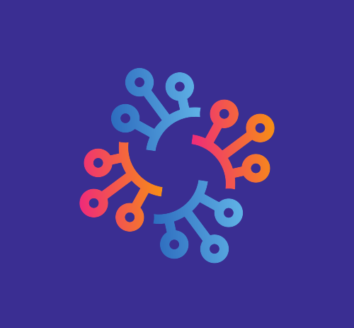

  

# MH - MultiHub Sistema de avaliação de profissionais :family_man_boy_boy:

O MH é um site com o proposito de divulgar o trabalho de profissionais de TI, com a chancela de empresas e projetos,
que este profissional atuou, as avaliações levam em consideração o tempo de experiência do profissional, o tempo de proficiência
nas tecnologias e a pontuação alcançada por esse profissional

O front-end da aplicação pode ser encontrado no seguinte repositório: [#](#)

## Funcionalidades 🤖

-   Cadastro de profissionais.
-   Cadastro de empresas.
-   Cadastro de projetos.
-   Avaliações de profissionais.
-   Etc...........

## Instalação 📦

Requer o [Python 3](https://www.python.org/downloads/) instalado para rodar.

Para usar o MH, siga estes passos:

1. Clone o repositório para a sua máquina.
2. Crie um ambiente virtual executando `python3 -m venv .multihub_venv` no terminal.
3. Ative o ambiente virtual executando `source .multihub_venv/bin/activate`.
4. Instale as dependências necessárias executando `pip install -r requirements.txt`.
5. Inicie o servidor back-end executando `python api/run.py` no terminal. Isso iniciará o servidor Flask em `http://localhost:5000`.
6. Acesse a documentação da API navegando para `http://localhost:5000/swagger-ui` em seu navegador da web.

## Uso

Ambos os códigos devem estar rodando, tanto o back-end quanto o front-end do aplicativo devem estar em execução. Aqui estão os passos para usar o aplicativo:

1. Inicie o servidor back-end executando `python api/run.py` no terminal. Isso iniciará o servidor Flask em um localhost. Um exemplo da aplicação inicada na porta 5000 pode ser acessado em: `http://localhost:5000`.
2. Para rodar o frontend siga as etapas no repositório.

## Arquitetura proposta

A arquitetura proposta para esse projeto é:

**Arquitetura em Camadas:** Essa arquitetura divide o aplicativo em camadas distintas, cada uma com uma responsabilidade específica. As camadas geralmente incluem a camada de apresentação (interação com o usuário), camada de lógica de negócios e camada de acesso a dados. Essa abordagem promove a separação de preocupações e facilita a manutenção e testabilidade do sistema.

## Usando Migrations

Para criar a migration com base nos seus arquivos de model e DTO execute o seguinte comando 

`alembic revision --autogenerate -m "add_professional_table"`

Para criar a tabela e ou atualizar o banco de dados execute:

`alembic upgrade head` 

## Contribuindo

Se você gostaria de contribuir com o MH, abra um pull request ou uma issue no repositório do GitHub.
